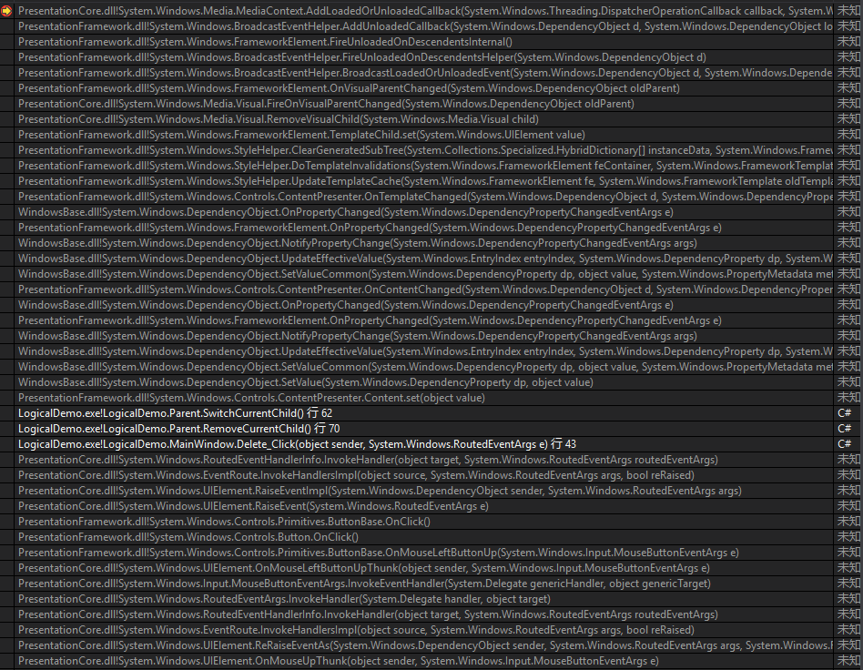
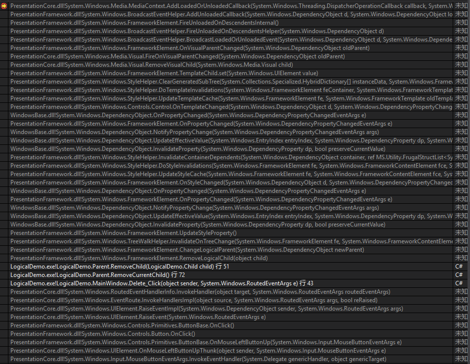
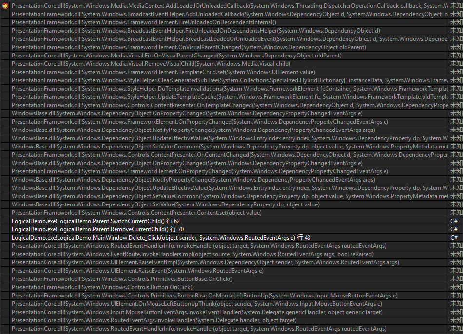

# Why Unload Twice ?
Why the `_problemChild` unloaded twice ? It really confused me.

## How to reproduce it ?

1. Clone this repository;
1. Run/Debug;
1. Click *Add Child* button several times;
1. Every time you click *Delete Child*, you'll got *Content Unloaded* output twice.

## Key points

- A non-generic style is added.
- When removing an FrameworkElement from a visual tree, it is also been removed from a logical tree at the same time.
- The visual tree and the logical tree is different.

## Stacks of this issue

### When a non-generic style of `Child` is added, the `Unloaded` event will be raised of these two operations.

Removing from visual tree with non-generic style  

Removing from logical tree with non-generic style  

### When only the generic style of `Child` is defined, the `Unloaded` event will be raised of only one operations.

Removing from visual tree with generic style  

